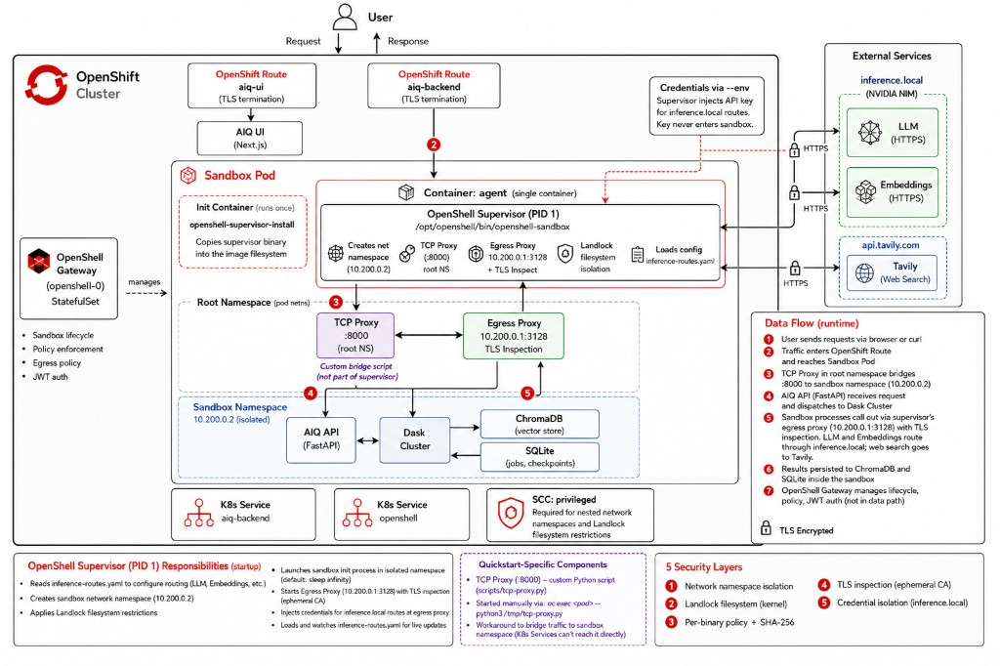

# Deploy secure AI research agents with NVIDIA OpenShell

Run autonomous AI research agents inside policy-enforced sandboxes on OpenShift, with kernel-level network and filesystem isolation.

## Table of Contents

- [Overview](#overview)
- [Detailed description](#detailed-description)
  - [Architecture](#architecture)
- [Requirements](#requirements)
  - [Minimum hardware requirements](#minimum-hardware-requirements)
  - [Minimum software requirements](#minimum-software-requirements)
  - [Required user permissions](#required-user-permissions)
- [Deploy](#deploy)
  - [Prerequisites](#prerequisites)
  - [Installation](#installation)
  - [Validating the deployment](#validating-the-deployment)
  - [Delete](#delete)
- [Repository structure](#repository-structure)
- [References](#references)
- [Technical details](#technical-details)
  - [OpenShell security model](#openshell-security-model)
  - [Egress policy](#egress-policy)
  - [Code isolation](#code-isolation)
  - [Network namespace bridge (TCP proxy)](#network-namespace-bridge-tcp-proxy)
  - [TLS inspection and ephemeral CA](#tls-inspection-and-ephemeral-ca)
  - [Credential isolation](#credential-isolation)
- [Known issues and troubleshooting](#known-issues-and-troubleshooting)
- [Tags](#tags)

## Overview

Long-running AI agents make autonomous decisions — calling LLMs, searching the web, and writing to databases over minutes or hours without human oversight. This quickstart demonstrates how to run these agents securely inside NVIDIA OpenShell sandboxes on OpenShift, where kernel-level policies restrict exactly which network endpoints, filesystem paths, and binaries the agent can use. Teams can deploy, experiment with, and extend a working research agent that is secure by default.

## Detailed description

Autonomous AI agents introduce a new class of security challenges. Unlike traditional API calls, long-running agents make multiple LLM-driven decisions over extended periods, and any of those decisions could produce unexpected tool invocations — reaching untrusted endpoints, exfiltrating data, or modifying system files. Standard container isolation is not sufficient because the agent has full network access and filesystem write permissions within the container.

NVIDIA OpenShell addresses this by wrapping agent workloads in sandboxes with five layers of kernel-enforced security: network namespace isolation, Landlock filesystem restrictions, per-binary network policy with SHA-256 verification, TLS inspection via ephemeral CA, and credential isolation through an inference routing proxy. The agent runs the same code, the same way — but OpenShell wraps it with security guardrails that are transparent to the application. See [docs/security-layers.md](docs/security-layers.md) for a detailed breakdown of each layer.

This quickstart deploys a complete research agent stack — NVIDIA AIQ with Dask parallel computing, a FastAPI async API, ChromaDB knowledge storage, and a Next.js UI — inside an OpenShell sandbox on OpenShift. The agent can perform deep and shallow research using NVIDIA NIM LLMs and Tavily web search, ingest documents into a knowledge base, and stream results via SSE. All of this runs within strict security boundaries — LLM credentials are isolated at the gateway and never enter the sandbox, and only explicitly allowed API endpoints are reachable.

### Architecture



**Data flow (high level):**

1. User sends requests via browser (**Next.js UI**) or **curl**
2. Traffic enters an **OpenShift Route** (`aiq-backend`) and is routed to the **Sandbox Pod**
3. A **TCP Proxy** in the pod's root namespace bridges `:8000` to the sandbox's isolated network namespace (`10.200.0.2`)
4. The **AIQ API** (FastAPI) receives the request and dispatches research jobs to the **Dask Cluster**
5. Dask workers call external services through the **Egress Proxy** (`10.200.0.1:3128`) — **NVIDIA NIM** is reached via `inference.local`, where the API key is injected by the proxy/gateway so it never enters the sandbox; **Tavily** uses the sandbox `.env` key directly
6. Results are persisted to **ChromaDB** and **SQLite**
7. The **OpenShell Gateway** (`openshell-0`) manages sandbox pod lifecycle, egress policy enforcement, and JWT auth

## Requirements

### Minimum hardware requirements

**Application (sandbox pod):**
- CPU: 2 vCPU (request) / 4 vCPU (limit)
- Memory: 4 GiB (request) / 8 GiB (limit)
- Storage: 2 GiB PVC for sandbox workspace

**UI:**
- CPU: 100m (request) / 500m (limit)
- Memory: 256 MiB (request) / 512 MiB (limit)

**OpenShell gateway:**
- CPU: 500m (request) / 1 vCPU (limit)
- Memory: 512 MiB (request) / 1 GiB (limit)
- Storage: 1 GiB PVC for gateway state

> **Note**: No GPU required. This quickstart uses external model endpoints (NVIDIA NIM via MaaS).

### Minimum software requirements

| Component | Version |
|-----------|---------|
| OpenShift | 4.14 or later (tested on 4.19) |
| Helm | 3.12 or later |
| `oc` CLI | 4.14 or later |
| Docker or Podman | For building container images (workstation) |
| OpenShell CLI | 0.0.62 or later ([install guide](https://github.com/NVIDIA/OpenShell#install)) |

### Required user permissions

This quickstart requires **cluster-admin** access for the following reasons:
- Installing the Agent Sandbox CRDs (cluster-scoped)
- Granting the `privileged` SCC to the sandbox service account (sandboxes use network namespaces and Landlock, which require elevated capabilities)

## Deploy

### Prerequisites

Before deploying, ensure you have:
- Access to a Red Hat OpenShift cluster (4.14+) with cluster-admin privileges
- `oc` CLI installed and authenticated (`oc login`)
- `helm` CLI (3.12+) installed
- Docker or Podman on your workstation (for building images)
- OpenShell CLI installed ([install guide](https://github.com/NVIDIA/OpenShell#install))
- An NVIDIA API key from [build.nvidia.com](https://build.nvidia.com) (free tier works)
- A Tavily API key from [app.tavily.com](https://app.tavily.com) (free tier works)

### Installation

#### 1. Clone the repository

```bash
git clone https://github.com/rh-ai-quickstart/secure-research-agent-openshell.git
cd secure-research-agent-openshell
```

#### 2. Set environment variables

```bash
export NAMESPACE="openshell"
export NVIDIA_API_KEY="nvapi-..."
export TAVILY_API_KEY="tvly-..."
```

#### 3. Build container images (optional)

If using pre-built images (recommended), **skip this step**. The chart defaults to pre-built images on `quay.io/rh-ai-quickstart`.

```bash
# Build all images
make build-images

# Push to a registry
export REGISTRY=quay.io/your-org
docker tag aiq-openshell:local $REGISTRY/aiq-openshell:latest
docker push $REGISTRY/aiq-openshell:latest
docker tag aiq-ui:local $REGISTRY/aiq-ui:latest
docker push $REGISTRY/aiq-ui:latest
```

If you build your own images, update the image references in `chart/values.yaml` or pass `--set` flags at install time.

#### 4. Deploy

There are two deployment approaches:

**Option A — AI-agent-driven (skill-based):**

Point your AI coding agent (Cursor, Claude, etc.) at the project and ask it to deploy. The agent will discover and follow the deployment skill at `.cursor/skills/deploy-aiq-openshell/SKILL.md`, which covers the full stack end to end. A separate skill for gateway-only deployment is available at `.cursor/skills/deploy-openshell-openshift/SKILL.md`.

**Option B — Makefile (manual/scripted):**

```bash
make install \
  NAMESPACE=$NAMESPACE \
  NVIDIA_API_KEY=$NVIDIA_API_KEY \
  TAVILY_API_KEY=$TAVILY_API_KEY
```

<details>
<summary>Manual step-by-step (click to expand)</summary>

If you prefer to deploy manually, run these steps in order:

```bash
# 1. Install Agent Sandbox CRDs
kubectl apply -f https://github.com/kubernetes-sigs/agent-sandbox/releases/latest/download/manifest.yaml

# 2. Create namespace
oc new-project $NAMESPACE

# 3. Create JWT signing keys (must exist BEFORE the gateway)
openssl genpkey -algorithm ed25519 -out /tmp/signing.pem
openssl pkey -in /tmp/signing.pem -pubout -out /tmp/public.pem
openssl rand -hex 16 > /tmp/kid
oc create secret generic openshell-jwt-keys -n $NAMESPACE \
  --from-file=signing.pem=/tmp/signing.pem \
  --from-file=public.pem=/tmp/public.pem \
  --from-file=kid=/tmp/kid

# 4. Deploy the OpenShell gateway (dev — embedding routing requires supervisor ≥ 0.0.63)
helm install openshell oci://ghcr.io/nvidia/openshell/helm-chart \
  --version 0.0.0-dev -n $NAMESPACE \
  --set image.tag=dev \
  --set supervisor.image.tag=dev \
  --set pkiInitJob.enabled=false \
  --set server.disableTls=true \
  --set server.auth.allowUnauthenticatedUsers=true \
  --set podSecurityContext.fsGroup=null \
  --set securityContext.runAsUser=null \
  --wait --timeout 120s

# 5. Grant privileged SCC to the sandbox service account
oc adm policy add-scc-to-user privileged -z openshell-sandbox -n $NAMESPACE

# 6. Deploy the AIQ chart (UI + backend service + secrets)
helm install secure-research-agent ./chart -n $NAMESPACE \
  --set apiKeys.nvidia=$NVIDIA_API_KEY \
  --set apiKeys.tavily=$TAVILY_API_KEY

# 7. Configure the NVIDIA inference provider (credential isolation)
oc port-forward svc/openshell 18080:8080 -n $NAMESPACE &>/dev/null &
sleep 3
openshell gateway add http://127.0.0.1:18080 --local --name ocp-qs
openshell gateway select ocp-qs
openshell provider create --name nvidia --type nvidia \
  --credential NVIDIA_API_KEY=$NVIDIA_API_KEY
openshell inference set --provider nvidia \
  --model nvidia/nemotron-3-nano-30b-a3b --no-verify

# 8. Create the sandbox (--env passes the NVIDIA key to the supervisor for credential isolation)
openshell sandbox create \
  --from quay.io/rh-ai-quickstart/aiq-openshell:latest \
  --name aiq-sandbox \
  --provider nvidia \
  --policy config/policy-egress.yaml \
  --env "NVIDIA_API_KEY=$NVIDIA_API_KEY" \
  --no-tty
```

</details>

Wait for all pods to be ready:

```bash
oc get pods -n $NAMESPACE -w
```

Expected pods:
- `openshell-0` — OpenShell gateway
- `aiq-sandbox` — AIQ research agent sandbox
- `aiq-ui-*` — Next.js frontend

#### 5. Start the agent inside the sandbox

After the sandbox pod is running, initialize the AIQ agent:

```bash
make start-agent NAMESPACE=$NAMESPACE
```

This script performs the following steps:
1. Copies the `.openshell.env` file (Tavily key, proxy config) and `config_openshell.yml` (LLM endpoints pointing to `inference.local`) into the sandbox pod
2. Creates a combined CA bundle (system CAs + OpenShell's ephemeral CA) so Python trusts the egress proxy's TLS inspection certificates
3. Configures the NVIDIA inference provider for credential isolation — the API key is stored at the gateway and injected by the proxy
4. Labels the sandbox pod for the Kubernetes backend Service
5. Deploys a TCP proxy in the pod's root network namespace to bridge traffic to the sandbox namespace
6. Starts the AIQ entrypoint inside the sandbox network namespace via `nsenter`

Wait for `Uvicorn running on http://0.0.0.0:8000` in the output.

> **Note**: The `openshell sandbox create` command may show a `connect_path is empty` error — this is expected on Kubernetes and does not affect the deployment. The sandbox pod is created successfully; the error only means the CLI could not establish an interactive SSH session.

### Validating the deployment

#### 1. Check all pods are running

```bash
oc get pods -n $NAMESPACE
```

#### 2. Get the UI URL

```bash
echo "https://$(oc get route aiq-ui -n $NAMESPACE -o jsonpath='{.spec.host}')"
```

Open this URL in your browser to access the research agent UI.

#### 3. Test the API

Port-forward the backend to your workstation:

```bash
oc port-forward pod/aiq-sandbox 8000:8000 -n $NAMESPACE &>/dev/null &
```

Run a health check:

```bash
curl -s http://127.0.0.1:8000/health
# → {"status":"healthy"}
```

List available agents:

```bash
curl -s http://127.0.0.1:8000/v1/jobs/async/agents
# → {"agents":[{"agent_type":"deep_researcher",...},{"agent_type":"shallow_researcher",...}]}
```

Submit a test research query:

```bash
JOB_ID=$(curl -s -X POST http://127.0.0.1:8000/v1/jobs/async/submit \
  -H 'Content-Type: application/json' \
  -d '{"input":"What is OpenShift?","agent_type":"shallow_researcher"}' \
  | python3 -c "import sys,json; print(json.load(sys.stdin)['job_id'])")
echo "Job ID: $JOB_ID"
```

Poll for results:

```bash
curl -s http://127.0.0.1:8000/v1/jobs/async/job/$JOB_ID | python3 -m json.tool
```

#### 4. Verify sandbox security

View the OpenShell sandbox logs to confirm security policies are active:

```bash
oc port-forward svc/openshell 18080:8080 -n $NAMESPACE &>/dev/null &
openshell gateway add http://127.0.0.1:18080 --local --name ocp-qs
openshell gateway select ocp-qs
openshell logs aiq-sandbox 2>&1 | grep -E "(CONFIG:|NET:|Landlock)"
```

You should see:
- `CONFIG:VALIDATED` — sandbox user verified
- `CONFIG:CREATED — Network namespace created` — isolated network
- `NET:LISTEN — 10.200.0.1:3128` — egress proxy active
- `CONFIG:BUILT — Landlock ruleset built` — filesystem sandbox applied

### Delete

To completely remove the deployment:

```bash
make uninstall NAMESPACE=$NAMESPACE
```

Or manually:

```bash
# Delete the sandbox
openshell sandbox delete aiq-sandbox

# Uninstall the Helm release
helm uninstall secure-research-agent -n $NAMESPACE

# Remove Agent Sandbox CRDs (optional — affects all users on the cluster)
kubectl delete -f https://github.com/kubernetes-sigs/agent-sandbox/releases/latest/download/manifest.yaml

# Delete the namespace
oc delete project $NAMESPACE
```

## Repository structure

```
.
├── .cursor/skills/               # AI agent deployment skills
│   ├── deploy-openshell-openshift/  # Gateway-only deployment on OpenShift
│   │   └── SKILL.md
│   └── deploy-aiq-openshell/       # Full-stack AIQ + OpenShell deployment
│       └── SKILL.md
├── .github/workflows/
│   └── ci.yaml                   # CI pipeline (lint, test, helm lint)
├── chart/                        # Helm chart for OpenShift deployment
│   ├── Chart.yaml                # Chart metadata and dependencies
│   ├── values.yaml               # Default configuration (images, API keys, resources)
│   └── templates/                # Kubernetes resource templates
│       ├── _helpers.tpl          # Template helpers
│       ├── scc-rolebinding.yaml  # Privileged SCC for sandbox SA
│       ├── jwt-secret.yaml       # OpenShell JWT signing keys (documentation only)
│       ├── sandbox-env-secret.yaml  # API keys and sandbox env vars
│       ├── aiq-backend-svc.yaml  # Backend Kubernetes Service
│       ├── aiq-ui-deployment.yaml   # Next.js UI Deployment
│       ├── aiq-ui-svc.yaml      # UI Service
│       ├── aiq-ui-route.yaml    # UI OpenShift Route
│       └── test-health.yaml     # Helm test hook
├── config/
│   ├── config_openshell.yml      # AIQ config with inference.local (credential isolation)
│   ├── inference-routes.yaml     # Standalone inference routes (LLM + embeddings via inference.local)
│   ├── policy-egress.yaml        # OpenShell sandbox egress policy
│   └── openshell.env.template    # Environment variable template
├── scripts/
│   ├── tcp-proxy.py              # Network namespace bridge (root NS → sandbox NS)
│   └── start-sandbox.sh          # Sandbox initialization and agent startup
├── tests/                        # Automated test suite
│   ├── test_tcp_proxy.py         # TCP proxy unit tests (asyncio)
│   └── test_helm_chart.py        # Helm chart lint and template validation
├── Containerfile                 # AIQ sandbox image (Ubuntu 24.04 + Python 3.12)
├── Containerfile.ui              # Next.js UI image
├── Makefile                      # Build, deploy, lint, test, validate, cleanup
├── docs/
│   ├── architecture-overview.png # Architecture diagram
│   └── security-layers.md        # Five security layers explained
├── LICENSE                       # Apache 2.0
└── README.md
```

## References

- [NVIDIA OpenShell](https://github.com/NVIDIA/OpenShell) — Sandboxed runtime for autonomous AI agents
- [NVIDIA AIQ](https://github.com/NVIDIA/AIQ) — AI research agent toolkit
- [OpenShift Documentation](https://docs.openshift.com/)
- [Landlock LSM](https://docs.kernel.org/userspace-api/landlock.html) — Linux kernel filesystem isolation
- [Agent Sandbox CRDs](https://github.com/kubernetes-sigs/agent-sandbox) — Kubernetes sandbox resource definitions
- [NVIDIA NIM](https://build.nvidia.com) — NVIDIA Inference Microservices
- [Tavily](https://tavily.com) — AI-optimized web search API
- [Bringing Claude self-hosted sandboxes to OpenShell on Red Hat AI](https://www.redhat.com/en/blog/bringing-claude-self-hosted-sandboxes-openshell-red-hat-ai) — Credential isolation and inference routing patterns
- [Red Hat AI and OpenShell: Driving security-enhanced agent execution](https://www.redhat.com/en/blog/red-hat-ai-and-openshell-driving-security-enhanced-agent-execution-for-enterprise-ai) — Three modes of agent sandboxing and enterprise validation

## Technical details

### OpenShell security model

OpenShell provides five layers of kernel-enforced isolation. This quickstart implements all five. See [docs/security-layers.md](docs/security-layers.md) for the full breakdown.

| Layer | What it protects | Implemented in this quickstart |
|-------|-----------------|-------------------------------|
| Network namespace isolation | Unauthorized outbound connections | Sandbox runs in 10.200.0.2; all traffic goes through egress proxy |
| Landlock filesystem isolation | System binary tampering, credential theft | Read-only `/app`, `/usr`, `/etc`; writable only `/sandbox`, `/tmp` |
| Per-binary network policy | Unauthorized process network access | Only Python/Dask binaries can reach allowed endpoints |
| TLS inspection (ephemeral CA) | Payload-level policy enforcement | Proxy terminates TLS, inspects traffic, re-encrypts with ephemeral CA |
| Credential isolation | API key exfiltration | NVIDIA API key stored at gateway; injected via `inference.local` proxy |

### Egress policy

The sandbox egress policy (`config/policy-egress.yaml`) works together with the inference routing proxy:

| Endpoint | Traffic type | Access method | Credential handling |
|----------|-------------|--------------|-------------------|
| `integrate.api.nvidia.com` | LLM chat | Via `inference.local` (supervisor proxy) | API key injected by supervisor — never enters sandbox |
| `integrate.api.nvidia.com` | Embeddings | Via `inference.local` (supervisor proxy) | API key injected by supervisor — never enters sandbox |
| `api.tavily.com` | Web search | Direct via `network_policies` | API key in sandbox `.env` file |

Both LLM and embedding traffic route through `inference.local` using a standalone inference routes file (`config/inference-routes.yaml`) baked into the sandbox image. NVIDIA NIM is **not** listed in `network_policies` — per OpenShell best practices, inference provider hosts should use credential isolation through `inference.local` instead. Tavily remains a direct endpoint because it is a non-inference service without a built-in provider profile.

Any connection attempt to hosts not covered by `network_policies` or `inference.local` is blocked by the egress proxy. To add additional services, add entries under `network_policies` in the policy file.

### Code isolation

All sandbox-specific code changes are gated behind the `OPENSHELL` environment variable:

| Change | Gate | Purpose |
|--------|------|---------|
| `--no-nanny` flag on Dask worker | `if os.environ.get("OPENSHELL")` | Landlock blocks POSIX semaphores used by Dask's Nanny |
| ChromaDB tenant bootstrap | `if os.environ.get("OPENSHELL")` | ChromaDB <1.0 needs explicit default_tenant creation |

When `OPENSHELL` is not set, these code paths are skipped — no impact on standard deployments.

### Network namespace bridge (TCP proxy)

The AIQ agent runs inside a nested network namespace (10.200.0.2) created by the OpenShell supervisor. Standard `oc port-forward` and Kubernetes Services can only reach the pod's root network namespace. A lightweight TCP proxy (`scripts/tcp-proxy.py`) runs in the root namespace and forwards port 8000 to the agent inside the sandbox namespace.

### TLS inspection and ephemeral CA

The OpenShell egress proxy performs TLS inspection to enforce network policies on HTTPS traffic. It generates an ephemeral CA certificate at `/etc/openshell-tls/openshell-ca.pem` inside the sandbox pod. The `start-sandbox.sh` script creates a combined CA bundle (system CAs + OpenShell CA) and sets `SSL_CERT_FILE`, `REQUESTS_CA_BUNDLE`, and `CURL_CA_BUNDLE` so that Python and curl trust the proxy's certificates.

### Credential isolation

The NVIDIA API key never enters the sandbox process. Both LLM chat and embedding traffic route through `inference.local` using a standalone inference routes file (`config/inference-routes.yaml`) baked into the sandbox image. The real API key is passed to the supervisor via `openshell sandbox create --env NVIDIA_API_KEY=...` and the sandbox process only has a placeholder.

When the agent makes an inference request (LLM or embedding):

1. The supervisor intercepts the HTTPS connection to `inference.local`
2. It matches the request against the routes file (chat completions or embeddings)
3. It injects the API key and forwards the request to `integrate.api.nvidia.com`
4. The agent never sees the API key — even if compromised, there is nothing to exfiltrate
5. The egress policy blocks direct access to `integrate.api.nvidia.com` as a defense-in-depth measure

This pattern follows OpenShell's recommendation: *"Do not add inference provider hosts to `network_policies`. Use OpenShell inference routing instead."*

Tavily uses a direct endpoint with its API key in the sandbox environment because it is a non-inference service without a built-in OpenShell provider profile.

## Known issues and troubleshooting

| Issue | Cause | Resolution |
|-------|-------|------------|
| `connect_path is empty` error during `openshell sandbox create` | The OpenShell CLI cannot establish SSH sessions to sandboxes on Kubernetes | Expected and non-fatal. The sandbox pod is created successfully. The agent is started separately via `make start-agent`. |
| `SSL: CERTIFICATE_VERIFY_FAILED: self-signed certificate in certificate chain` | The agent process doesn't trust the OpenShell egress proxy's ephemeral CA | Run `make start-agent` which creates the combined CA bundle automatically. If starting manually, see the TLS inspection section above. |
| `403 Forbidden` from the egress proxy | The agent process is running in the pod's root network namespace instead of the sandbox namespace | Ensure the agent is started via `nsenter --net=/proc/<sleep_pid>/ns/net` (handled by `start-sandbox.sh`). Do not use plain `oc exec` to run the entrypoint. |
| Image pull timeout during sandbox creation | Container registry (quay.io) is temporarily unavailable or slow | Delete the sandbox (`openshell sandbox delete aiq-sandbox`) and recreate. The pod will retry image pulls automatically with exponential backoff. |
| `403 - connection not allowed by policy` on document upload/embeddings | Supervisor version too old (< 0.0.63) — embedding routing not supported | Upgrade to chart version `0.0.0-dev` with `--set image.tag=dev --set supervisor.image.tag=dev`. Embedding routing via `inference.local` requires supervisor ≥ 0.0.63. |
| `410 Gone — model has reached end of life` on embeddings | Embedding model in `config/inference-routes.yaml` is deprecated | Update the `model` field in the `openai_embeddings` route to the current model (e.g. `nvidia/llama-nemotron-embed-vl-1b-v2`), rebuild and push the image, then recreate the sandbox. |
| `address already in use` on port 8000 | Both the TCP proxy and agent are trying to bind port 8000 in the same namespace | The TCP proxy must run in the root namespace (via `oc exec`) and the agent in the sandbox namespace (via `nsenter`). Check `ss -tlnp` inside the pod to verify. |

## Tags

* **Title:** Deploy secure AI research agents with NVIDIA OpenShell
* **Description:** Run autonomous AI research agents inside policy-enforced sandboxes on OpenShift with kernel-level isolation
* **Industry:** Media and IT services
* **Product:** OpenShift
* **Use case:** Security, AI agent sandboxing
* **Partner:** NVIDIA
* **Contributor org:** Red Hat
